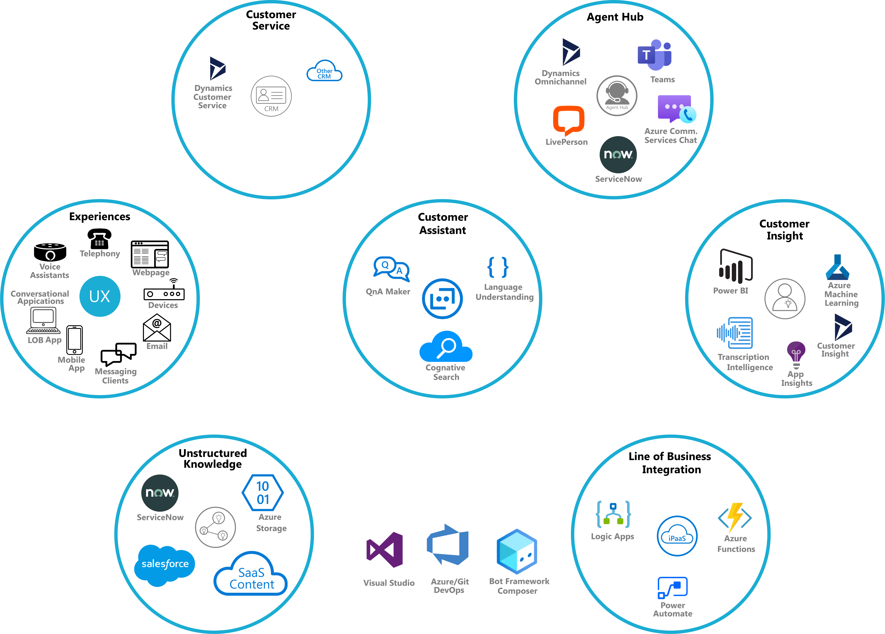

# Conversational Touchpoint Accelerator
## Overview
## Solution Elements

##### Figure 1: Solution Elements
Figure 1 shows the various solution elements of the touchpoint accelerator which 
will extend the standard Bot Framework virtual assistant pattern in the following ways:
### Agent Hub
Recipe for message-based live chat support through integration with solutions like Dynamics
365 Omnichannel for Customer Service, LivePerson Customer Care, ServiceNow, Azure
Communication Services, and Teams.

The agent hub solution element also include a recipe for stand-alone call center support
or integration with existing call center solutions.

This agent hub element provides support for informal, low cost scenarios like an internal 
"help desks" and more sophisticated and capable solutions targeting an enterprise call
center.
### Customer Service
A "plug-in" approach for the integration of 1st and 3rd party customer service solutions.  The
initial focus will be on supporting Dynamics 365 Customer Service.
### Client Experiences
Extends the standard Bot Service client experiences to include [Conversational Applications](http://aka.ms/capps) 
which provide conversationally-immersive desktop and mobile client experiences.
### DevOps
Recipe for employing DevOps to develop and operate the Customer Assistant solution.
### Analytics
Extends the standard Bot Framework analytics to include call center specific analytics that will 
provide customer service insight across every conversational touchpoint in an enterprise.
### iPaaS
A recipe for how to integrate backend services, business processes, and SaaS solutions.
### Security & Scale
A recipe for how to secure and scale an enterprise Customer Assistant solution.
## Get Started
- Step 1
- Step 2
- ...
- Step N
## Solution Topic 1
To do XYZ you need to....
## Solution Topic N
Blah, blah, blah, blah...
## Support and Feedback
- [Ask a question on Stack Overflow](http://add.url.com)
- [Request a new feature](http://add.url.com)
- [File an issue](http://add.url.com)
## Related project (optional)
Here is a realted project:
- [Some related project title](http://add.url.com)
## Contributing
[Add contributing section]